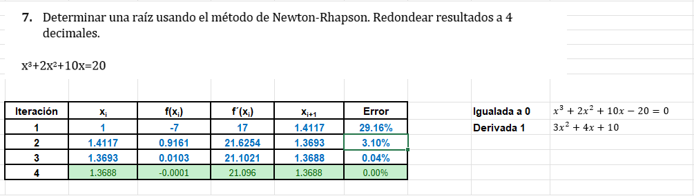
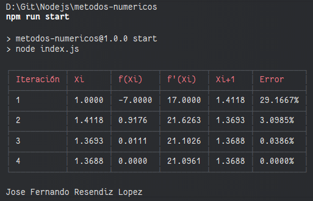

# Métodos Numéricos

En la clase de Métodos Numéricos nos enseñan el uso de distintos métodos para resolver problemas matemáticos que no pueden ser resueltos analíticamente. Estos métodos son de gran utilidad en diversas áreas de la ingeniería, física, economía, entre otros.

## Método de Newton-Raphson

El método de Newton-Raphson es uno de los algoritmos más utilizados para encontrar raíces de funciones. La idea básica detrás de este método es utilizar la derivada de una función para aproximar sus raíces de manera iterativa.

### ¿Por qué usar Newton-Raphson?
- **Eficiencia**: Es un método muy rápido y habitualmente converge en pocas iteraciones.
- **Sencillez**: Su implementación es bastante directa y no requiere cálculos complejos más allá de la derivada de la función.
- **Versatilidad**: Puede utilizarse para una amplia gama de funciones no lineales y se aplica en múltiples disciplinas.

## Ejemplo

Con este ejercicio se intenta replicar la siguiente:



Este gráfico muestra cómo el método de Newton-Raphson aproxima la raíz de la función en cada iteración, mejorando la precisión en cada paso.

## Resultado en consola
La forma de representarlo fue mediante consola para la sencillez, usando una librería
para generar tablas y después convertirlas en cadenas (string)



## Código

A continuación se muestra un ejemplo básico de la implementación del método de Newton-Raphson en JavaScript:

```javascript
function newtonRaphson() {

    // Datos generales
    const x0 = 1; // Valor inicial
    const tolerance = 0.0001; // Tolerancia para detener la iteración
    const maxIterations = 100; // Número máximo de iteraciones para que no loop

    // Variables temporales
    let results = [];
    let xi = x0;
    let error = Infinity;
    let iteration = 0;

    while (error > tolerance && iteration < maxIterations) {
        let fXi = f(xi);
        let fPrimeXi = fPrime(xi);
        let xiPlus1 = xi - fXi / fPrimeXi;

        error = Math.abs((xiPlus1 - xi) / xiPlus1) * 100;

        results.push({
            Iteration: iteration + 1,
            Xi: xi,
            fXi: fXi,
            fPrimeXi: fPrimeXi,
            XiPlus1: xiPlus1,
            Error: error.toFixed(4) + '%'
        });

        xi = xiPlus1;
        iteration++;
    }

    return results;
}